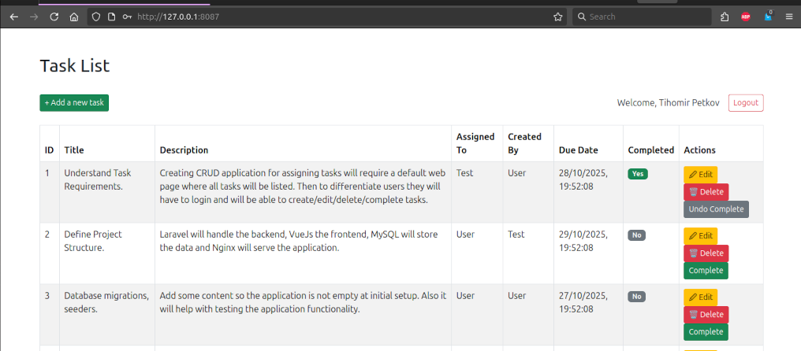

# Task assigning application

Default web page with all users' tasks - a public resource.</br>
Only logged in users can add/edit/delete/assign/complete a task.</br>

## Setup
```
git clone https://github.com/killedit/progress-task.git
cd progress-task
docker compose up -d --build
```
If you want to follow the docker container logs remove the `-d` flad so you don't detach at the build process.

The application should run migrations and seeders.</br>
There are two example users `test@example.com` with password `test123` and `user@example.com` with password `user123`.</br>
Creating new users is possible and recommended, but not not necessary to test functionality.</br>

The back-end, Laravel Rest API, runs at:</br>
`http://127.0.0.1:8007`

The front-end, Vue App, runs at:</br>
`http://127.0.0.1:8087/`

This requires the use of `CORS`, cross-origin resource sharing. The browser makes preflight `OPTION` requests to the back-end, which should happen before any actuall request, to find out if that resource is allowed to be accessed. 




## Connect to the database

Option 1: Connect to `progress_mysql` container:

```
docker exec -it progress_mysql bash
mysql -u root -p
    admin123
use progress;
show tables;
...
```

Option 2: Create a new db connection in DBeaver.

```
Server Host:    127.0.0.1
Port:           3307
Database:       progress
Username:       laravel_user
Password:       user123

Driver properties:
    allowPublicKeyRetrieval     TRUE
    useSSL                      FALSE

Test Connection...
```

## Overall project structure:

```
2025-10-20-progress-task
├── /docker
│   └── /nginx
│       └── default.conf     <- Nginx configuration file for serving the application
│   └── /php
│       └── /conf.d
│           └── xdebug.ini   <- PHP configuration for Xdebug
├── /laravel                 <- Backend
│   ├── Dockerfile           <- Dockerfile for the Laravel backend
│   ├── .env                 <- Laravel specific environment variables - Laravel DB settings
│   └── ...
├── /vuejs                   <- Frontend
│   ├── Dockerfile           <- Dockerfile for the Vue.js frontend
│   └── ...
├── docker-compose.yaml      <- This does the magic.
├── .env                     <- main environment variables - MySQL docker container intialization
```

## REST API resources

| Method   | Endpoint                   | Controller              | Description                                                    |
| -------- | -------------------------- | ----------------------- | -------------------------------------------------------------- |
| `GET`    | `/api/tasks`               | TaskController@index    | List all tasks (auth user’s tasks or public tasks). Paginated. |
| `POST`   | `/api/tasks`               | TaskController@store    | Create a new task (auth user).                                 |
| `GET`    | `/api/tasks/{id}`          | TaskController@show     | View a single task (only if user owns or created it).          |
| `PUT`    | `/api/tasks/{id}`          | TaskController@update   | Update task fields (only if user owns or created it).          |
| `DELETE` | `/api/tasks/{id}`          | TaskController@destroy  | Delete task (only if user owns or created it).                 |
| `PATCH`  | `/api/tasks/{id}/complete` | TaskController@complete | Mark a task as completed (only if user owns or created it).    |

### How to test the API endpoints:

1. To run tests import the Postman collection and enviroment from Laravel folder:

`/laravel/postman/2025-10-25-progress-task-environment.json` </br>
`/laravel/postman/2025-10-20-progress-task-postman_collection.json`

 
 
 

2. Curl requests in the terminal:

```
curl -v -X POST 'http://127.0.0.1:8007/api/login' -H 'Content-Type: application/json' -d '{"email":"test@example.com","password":"test123"}'

    HTTP/1.1 200 OK
    {"user":{"id":1,"name":"Test","email":"test@example.com","email_verified_at":"2025-10-26T11:01:04.000000Z","created_at":"2025-10-26T11:01:04.000000Z","updated_at":"2025-10-26T11:01:04.000000Z"},"token":"11|HQE6aZH1hvxCTfDd0CbqLlHYu1aKMbBuaRoEYfu81279e952"}

curl -v -X GET 'http://127.0.0.1:8007/api/tasks' -H 'Accept: application/json' -H 'Autorization: Bearer {HQE6aZH1hvxCTfDd0CbqLlHYu1aKMbBuaRoEYfu81279e952}'

    HTTP/1.1 200 OK
    {"current_page":1,"data":[{"id":1,"title":"Understand Task Requirements.","description":" ...

http://127.0.0.1:8007/api                           ← If opened in the browser should show "API is running".
http://127.0.0.1:8007/api/tasks
```
3. OpenAPI Swagger (in progress):

The documentation is generated with `php artisan l5-swagger:generate` and accessible at: </br>
`http://127.0.0.1:8007/api/documentation` </br>


## Integration Testing
Due to the size of the application I have decide to run only integration tests to check the functionality of the application. Whether user can login and register, create and delete tasks, ect.

Attach to Laravel container:
```
docker exec -it progress_laravel bash
```
Run the test:
```
php artisan config:clear
php artisan migrate:fresh --env=testing
php artisan test
```
 

There's a lot to be desired when it comes to code coverage:
```
vendor/bin/phpunit --coverage-html=storage/coverage
XDEBUG_MODE=coverage ./vendor/bin/phpunit --coverage-text
```

 

Test result are in: </br>
`/storage/coverage/index.html` </br>
`/storage/coverage/dashboard.html`

Things to improve:
- The technical debt - format, clean up and optimize code! Time limit was short, less than a week:]
- Finish the swagger documentaion. Postman collection and environment are provided for all REST API resources.
- For convenience `.env` files are in project. The `.env` file should NOT be in the repository. Secret management services should be used like environment variables in CI/CD platforms, Docker secrets, etc.
- Some tests for the front-end. It was tested just manually.
- The queries could be improved. Also haivng an option to soft delete records - `del` of type enum('no','yes') and information about who modified a record and how many times a records was modified will be nice.